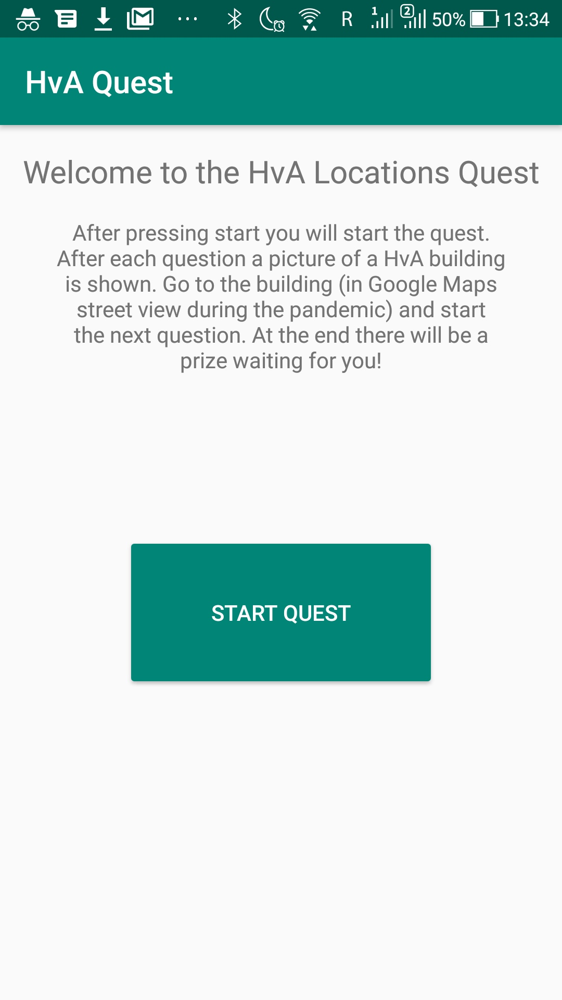
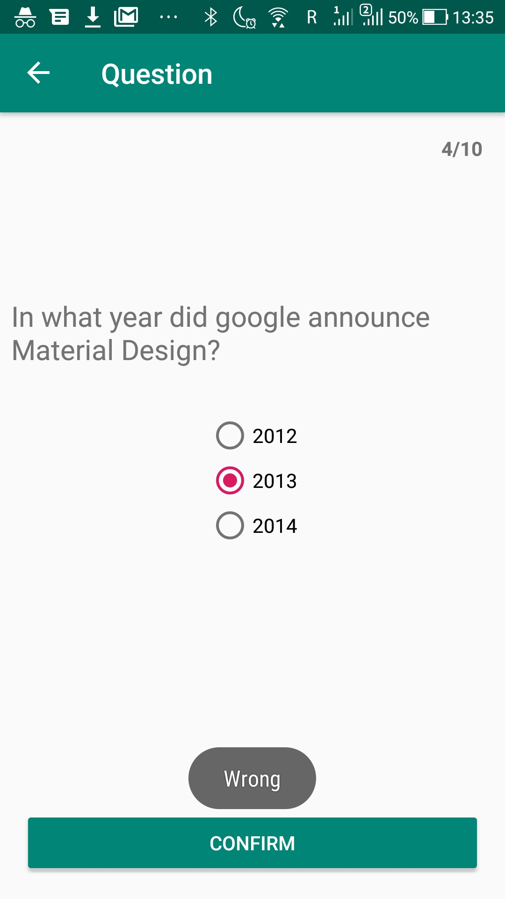
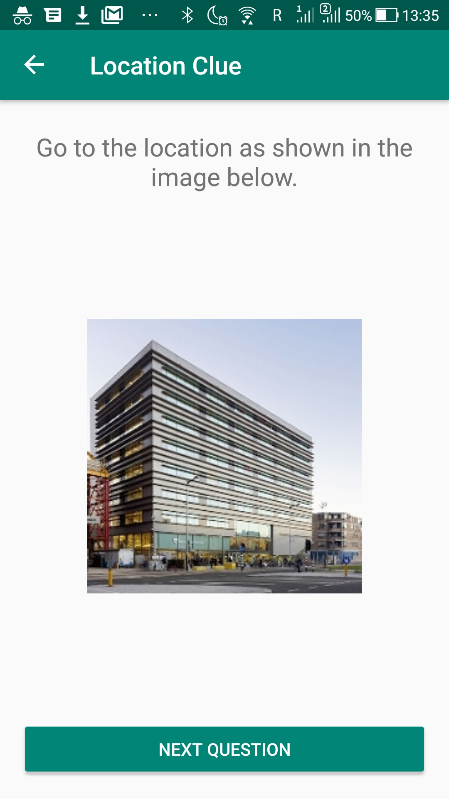
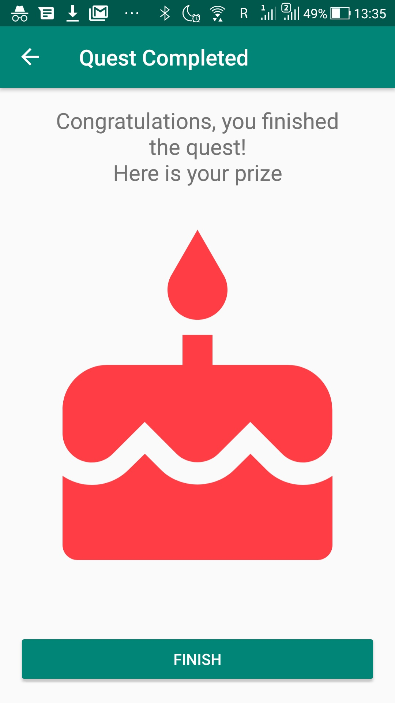

# Level 7 Learning Task 2 - HvA Quest
This is an app in which you can play a quest.
## What's inside
* A set of questions is loaded and displayed in order.
* A user starts the quest from the homescreen.
* When the quest is started first a question displayed.
* When a question is answered correctly then a HvA location is shown.
* The next question is shown when the user clicks on the “next” button. 
* After the last location is shown the user sees a festive screen with the prize.
* Navigation Components and ViewModel are used.

Also, backwards navigation works correctly by design.

## Screenshots
    
    
